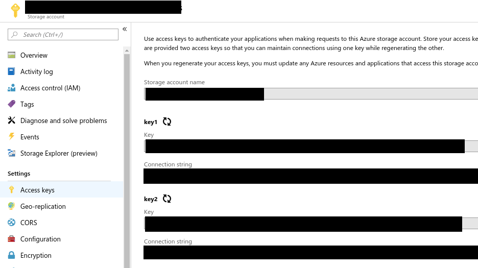

AzureBlob
=========

The *AzureBlob* package provides functionality for downloading and uploading content between Julia and [Azure Blob Storage](https://azure.microsoft.com/en-us/services/storage/blobs).

The interaction is through the REST interface provided by the blob storage.
Downloading files uses HTTP GET and uploading uses HTTP PUT through the [HTTP package](https://github.com/JuliaWeb/HTTP.jl).

**Note**: 
I have not used Azure since the spring of 2019 and have no way of checking if this package still works. 
Feel free to submit PRs.


## Authorization details

Authorization happens with the `SharedKey` scheme as described in [official docs](https://docs.microsoft.com/en-us/rest/api/storageservices/authorize-with-shared-key).
This uses a signature that needs the storage account and storage key of the blob storage.

The "Access keys" tab of a storage account look like this (in early 2019):



The storage account name is available in the top left corner and the storage key is one of the "Key" fields.


## Usage

Aquire a storage key (`<storagekey>`) as explained above.
We also need the blob (`<blob>`) to download/upload to; the directory (`<directory>`); the container (`<container>`); and the storageaccount (`<storageaccount>`).

There is no concept of a folder hieraki in a blob storage, but if you click through a storage browser (e.g. in the Azure portal) the location of a blob is `<storageaccount> / <container> / <directory> / <blob>`.

For the example here we want to upload the very simple JSON document `{content}` to our specified blob:

```julia
julia> put_blob("{content}", "<blob>", "<directory>", "<container>", "<storageaccount>", "<storagekey>")

HTTP.Messages.Response:
"""
HTTP/1.1 201 Created
Transfer-Encoding: chunked
Content-MD5: KncWDXFIHB36Li0LJfj15g==
Last-Modified: Mon, 18 Feb 2019 22:18:05 GMT
ETag: "0x8D695EEF4751D8E"
Server: Windows-Azure-Blob/1.0 Microsoft-HTTPAPI/2.0
x-ms-request-id: 9a2ae5b7-d01e-0033-03d7-c789d6000000
x-ms-version: 2017-04-17
x-ms-request-server-encrypted: true
Date: Mon, 18 Feb 2019 22:18:05 GMT

"""
```

We can now download the very same blob:

```julia
julia> get_blob("<blob>", "<directory>", "<container>", "<storageaccount>", "<storagekey>")

HTTP.Messages.Response:
"""
HTTP/1.1 200 OK
Content-Length: 9
Content-Type: application/json
Content-MD5: KncWDXFIHB36Li0LJfj15g==
Last-Modified: Mon, 18 Feb 2019 22:18:05 GMT
Accept-Ranges: bytes
ETag: "0x8D695EEF4751D8E"
Server: Windows-Azure-Blob/1.0 Microsoft-HTTPAPI/2.0
x-ms-request-id: 9a2af6cf-d01e-0033-71d7-c789d6000000
x-ms-version: 2017-04-17
x-ms-lease-status: unlocked
x-ms-lease-state: available
x-ms-blob-type: BlockBlob
x-ms-server-encrypted: true
Date: Mon, 18 Feb 2019 22:18:14 GMT

{content}"""
```

Other types of storage are also possible, but I have not implemented those.


## Tests

The main functions of the *AzureBlob* package (`get_blob` and `put_blob`) are *not* tested in the unit tests since I do not have a publicly accessible blob storage.


## Acknowledgement

The *AzureBlob* package is inspired by similar functionality in the [AzureSMR package for R](https://github.com/Microsoft/AzureSMR).
This functionality is probably also available in the [cloudyr packages](https://github.com/cloudyr).

